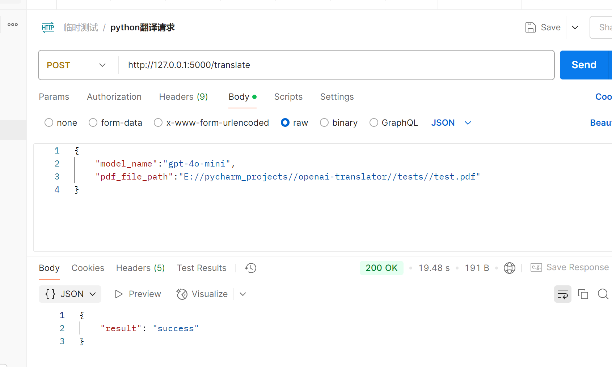

项目启动说明：

1、python项目在 main_api.py文件中启动

2、vue项目在 translation-ui目录下启动 执行 npm run serve

项目说明：
* 支持图形用户界面（GUI），提升易用性。
* 服务化：以 API 形式提供翻译服务支持。
* 添加对其他语言的支持。
* 添加对保留源 PDF 的原始布局的支持——待处理

**一、项目分为几个模块：**

1、pdf解析模块——用于获取原文

2、OpenAI模型模块——用于进行翻译

3、prompt提示词模块——用于构造提示词，便于扩展

4、writer输出模块——将翻译后的内容进行输出

5、读取配置文件模块——用于归纳配置内容

6、logger日志模块——用于记录日志


**二、使用的相关依赖包：**

1、loguru 是 Python 中一个简单且强大的日志记录库，旨在为开发者提供比 Python 内置的 logging 模块更便捷、更具表现力的日志记录解决方案。

2、pyyaml 是广泛用于解析和生成 YAML 数据的包

3、argparse 是 Python 标准库中的一个模块，用于编写用户友好的命令行接口。
程序定义它需要的参数，然后 argparse 会负责如何从 sys.argv 中解析出这些参数。
它可以帮助开发者轻松地解析命令行参数，让用户能够通过命令行向程序传递不同的选项和参数，使程序更加灵活和易用。

4、Pillow 是 Python 中处理图像的首选库

5、pandas

6、pdfplumber

7、在 ReportLab 这个强大的 Python 库中，pdfmetrics 是其内部的一个重要模块。
ReportLab 主要用于创建 PDF 文档，pdfmetrics 模块则在字体管理和度量方面发挥着关键作用。

8、Flask 是一个轻量级的 Web 框架，用于搭建简单的API服务
````
在 main_api.py文件中定义 api服务，通过 pycharm的debugger或者非debugger模式启动项目，
通过在 postman发起如下请求来访问

````
**三、前端框架**

1、vue+elementPlus

**四、新知识点**

1、为什么使用 yield关键字
* 原理：当使用 yield 时，函数会变成一个生成器（generator）。生成器是一种特殊的迭代器，它采用惰性求值（lazy evaluation）的方式工作。这意味着它不会一次性生成所有结果并存储在内存中，而是在每次调用时才生成一个结果。对于处理大规模数据或无限序列时，这种方式能显著减少内存占用。
* 示例：假设你有一个非常大的 Pandas 数据框，如果你将数据框中所有元素的行索引、列索引和元素值的三元组一次性存储在一个列表中，可能会占用大量内存。而使用 yield 逐个生成这些三元组，每次只在需要时生成一个，内存中只需保存当前生成的三元组，大大节省了内存。
